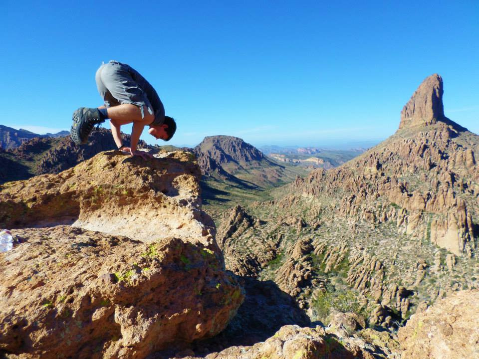

# Building a Sustainable Business w/ the Freemium Business Model

### Patrick Rauland - @BFTrick

---

# [fit] Freemium
# [fit] for the Rest of Us

---

# About Me

* From: Wisconsin

---

# About Me

* From: Wisconsin
* Love: Yoga

---

# About Me

* From: Wisconsin
* Love: Yoga
* Occupation: Support Ninja for WooThemes

---

# [fit]WooCommerce

---

---

---

# [fit]What is Freemium?

---

# Free food at the mall

---

# Free Chapters of Sequel

---

# Premium Content

---

# Angry Birds

---

# Candy Crush

---

# Dungeon Keeper

---

# 30 Second Clips

---

# [fit] Advantages of
# [fit] Freemium

---

# [fit] People Can See
# [fit] What it Really is

^ I knew that WooCommerce was going to be a good product even before I tried it because I had previous used and modified Features & Testimonials.

^ Leo Babauta blogs several times a week so you can understand him and then he releases premium contests, groups, videos, etc.

^ A friend of mine, Kevin McLeod, who scores music gives away a ton of music so people know his name

---

> 60% of our sales come after users read our documentation

-- Warren Holmes in http://www.warrenholmes.co.za/documentation-marketing/

---

# [fit] Collaboration

^ You can’t be an expert at everything. No one can. This way we can pool resources together to come up with the best solution.

^ I know I’ve committed to WooThemes projects to get a project done.

^ Commentors on my blog have helped other commentors.

---

# [fit] Freemium Flavors

---

# Donation

---

# Branding / Self Promotion

---

# Branding / Self Promotion

### One of the products in this video uses the freemium model. Which one is it?

[https://www.youtube.com/watch?v=A3PDXmYoF5U](https://www.youtube.com/watch?v=A3PDXmYoF5U)

---

# Extensions / Add-ons

---

# Follow Up

Kim Gjerstad - Freemium, a sustainable model for your plugin - http://www.youtube.com/watch?v=cjSPkQ-v8To

---

# [fit] Questions??

# [fit] Patrick Rauland - @BFTrick

---

# Attribution

* Wisconsin - http://www.flickr.com/photos/7643570@N04/8342464016
* Starbucks Free Sample - http://www.flickr.com/photos/48889062369@N01/4948232118/
* High heels - http://www.flickr.com/photos/22132593@N08/3975476236/
* Gears - https://www.flickr.com/photos/38383999@N06/3552898254
* Building Blocks -
http://www.flickr.com/photos/51980416@N03/5315722243
* Ice Cream - http://www.flickr.com/photos/34997998@N00/129640404/
* Tip Jar - http://www.flickr.com/photos/16227888@N00/4385845328/
